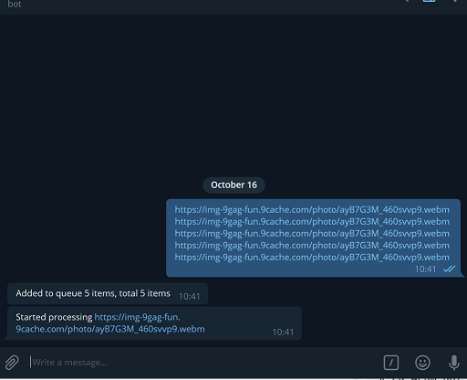

# Webm Bot


## Overview
Telegram bot that receives links with video in two formats(mp4|webm), downloads, converts if needed, and uploads to telegram channel as video messages.
 
### Requirements
* NodeJS >= 8
* Ubuntu 16.04
* MongoDB 3.x
* ffmpeg


### Configuration

#### Mode
You can set "channel" or "chat" mode with command ```/set_mode <mode>```


* chat - will send video directed you
* channel - will send video in your channel


#### Channel settings
For use this bot with channel mode you need to set channel 
1) Add this bot as Admin to your channel
2) Set your channel by command ```/set_channel @channel_name```
3) Set mode channel by command ```/set_mode channel```

### Base setup

1) Create telegram bot by [BotFather](https://telegram.me/botfather)
3) Clone and set variables in .env file
``` bash
# git clone https://github.com/Edisoni/webm_bot webm_bot
# cd webm_bot
# npm install
# npm start
# mv .env-example .env
```


### Screenshot


### Todo
* Queue limit 
* Check for identical links
